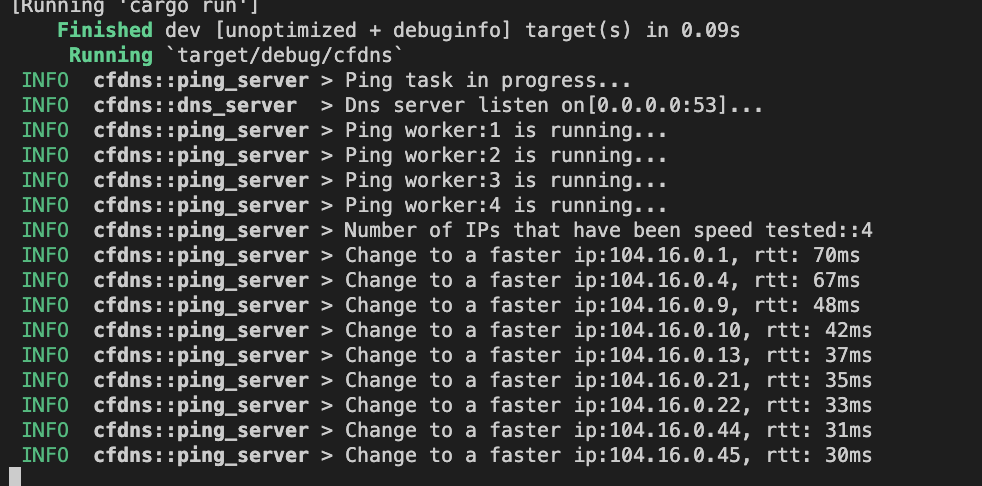
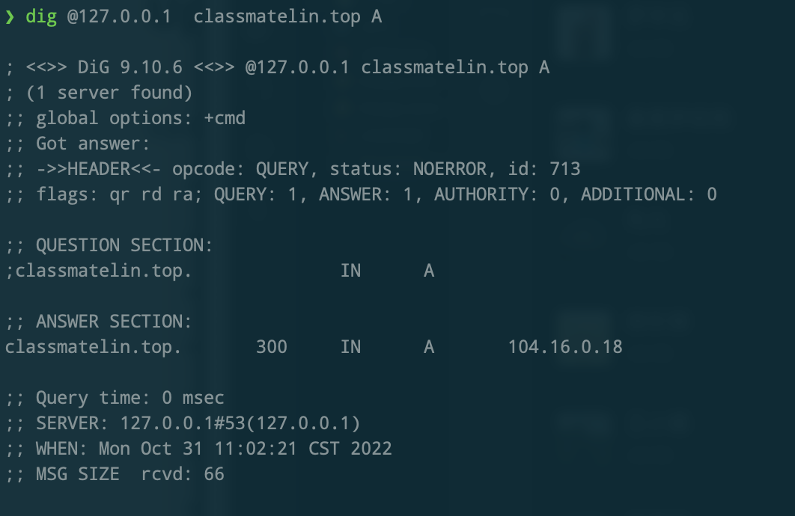
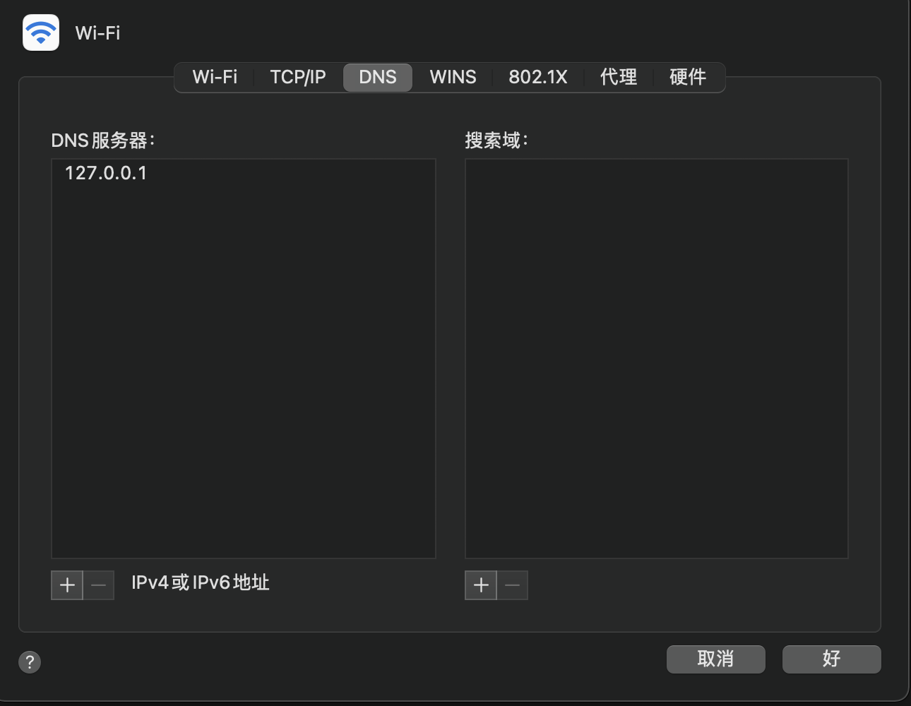

# cfdns

## 简介

测试Cloudflare CDN 延迟，获取最快的IPV4。

内置DNS服务, 无需手动改Hosts文件。

## 安装

### 使用二进制

- 下载[release](https://github.com/ClassmateLin/cfdns/releases)。
- `RUST_LOG=info ./cfdns`

### Docker


## 自行编译

**请确保您已正确安装了Rust.**

- `git clone https://github.com/ClassmateLin/cfdns.git && cd cfdns`

- `cargo build --release`, 编译结果在`./target/release`目录下。


## 使用

### 配置说明

``` 
├── cfdns
└── conf
    ├── config.toml
    ├── domain.txt
    └── ip.txt
```

- ip.txt的内容是Cloudflare的地址范围, 可自行精简。
- domain.txt的内容是需要经过cfdns返回最快的IP的域名, 一行一个。
- config.toml是配置文件, 详细内容请自行看配置文件。


### 运行程序

- 使用命令`RUST_LOG=info ./cfdns`运行:



- 使用dig测试:



- 将设备的DNS配置改为cfdns绑定的地址。




## 其他

- 可放在路由器中运行, 将上游服务器设置为dnsmasq/smartdns。

## todo

- [x] 支持自动判断Cloudflare CDN域名, 返回较快的IP。
- [] 支持Docker.