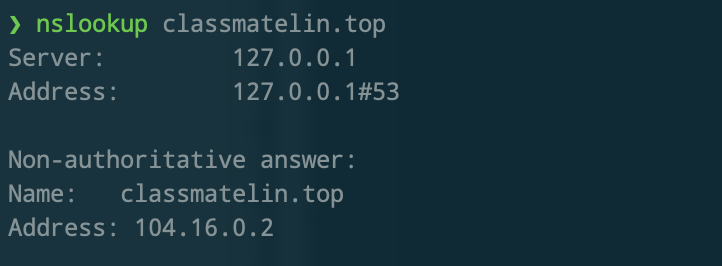

# cfdns

## 简介

测试Cloudflare CDN 延迟，获取最快的IPV4。

内置DNS服务, 无需手动改Hosts文件。

## 安装

### 使用docker

- 创建映射目录: `mkdir -p cfdns/conf && cd cfdns`
- 下载配置文件: `wget https://raw.githubusercontent.com/ClassmateLin/cfdns/main/conf/config.toml -O ./conf/config.toml`
- 下载ip地址文件: `wget https://raw.githubusercontent.com/ClassmateLin/cfdns/main/conf/ip.txt -O ./conf/ip.txt`
- 运行容器: `docker run -itd  -e  RUST_LOG=info -v conf:/conf -p 9053:53/udp --name cfdns classmatelin/cfdns`
- 查看运行日志: `docker logs cfdns`
- 测试服务是否正常解析: `dig @127.0.0.1 -p 9053 www.cloudflare.com`

### 使用二进制

- 下载[release](https://github.com/ClassmateLin/cfdns/releases)。
- `RUST_LOG=info ./cfdns`

### Docker


## 自行编译

**请确保您已正确安装了Rust.**

- `git clone https://github.com/ClassmateLin/cfdns.git && cd cfdns`

- `cargo build --release`, 编译结果在`./target/release`目录下。


## 使用

### 配置说明

``` 
├── cfdns
└── conf
    ├── config.toml
    └── ip.txt
```

- ip.txt的内容是Cloudflare的地址范围, 可自行精简。
- domain.txt的内容是需要经过cfdns返回最快的IP的域名, 一行一个。
- config.toml是配置文件, 详细内容请自行看配置文件。


### 运行程序

- 使用命令`RUST_LOG=info ./cfdns`运行:


- 使用dig测试:


- 将设备的DNS配置改为cfdns绑定的地址。





## 其他项目

- [抖音视频批量下载](https://github.com/ClassmateLin/douyin-downloader)
- [丘大叔签到](https://github.com/ClassmateLin/uncle-qiu-sign-in)
- [JD东东农场](https://github.com/ClassmateLin/jd-farm)
- [JD签到领京豆](https://github.com/ClassmateLin/jd-take-bean.git)
- [zzdns本地DNS解析器](https://github.com/ClassmateLin/zzdns)
